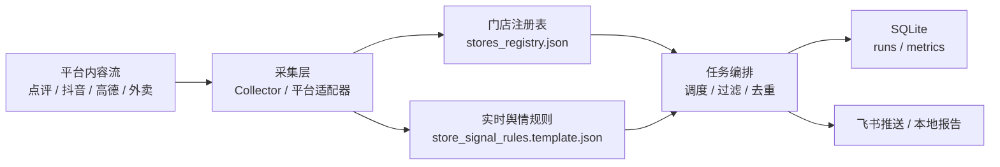

# 团购+外卖实时自动数据监测系统

> 悬赏：¥3,000 RMB  
> 当前状态：MVP v1（可运行骨架 + 门店级实时舆情精筛预置版）

## 项目目标

构建一套可持续运行的数据监测系统，覆盖评价平台与外卖平台采集、数据存储、统计汇总、飞书推送与运行审计。

本仓库当前提供首版可运行实现，重点解决以下问题：
- 多平台任务统一调度
- 采集结果结构化落库（SQLite）
- 飞书推送可追踪
- 支持定时窗口策略（评价每2小时、外卖每30分钟）
- 门店级实时舆情规则匹配、排除词过滤与命中打分

## 当前运行视图



## 当前交付范围（MVP v1）

### 1) 采集层
- 统一采集接口 `Collector`
- 已接入 6 个任务位（示例数据驱动）
  - 评价：大众点评 / 抖音来客 / 高德
  - 外卖：美团 / 饿了么 / 京东外卖

### 2) 调度层
- 评价窗口：10:00-20:00，间隔 2 小时
- 外卖窗口：10:30-12:30、17:00-19:00，间隔 30 分钟
- 支持 `scheduled`（按窗口）与 `all`（强制全量）两种模式
- 运行时会读取门店注册表，只执行“已绑定账号”的平台任务

### 3) 存储层
- SQLite 持久化
- 运行记录表：`runs`
- 指标明细表：`metrics`
- 任务游标表：`task_state`

### 4) 推送层
- 飞书机器人 webhook 推送
- 无 webhook 时自动降级为本地日志输出

### 5) 门店实时舆情精筛层（预置版）
- 门店规则文件：`examples/store_signal_rules.template.json`
- 规则能力：
  - 包含词
  - 排除词
  - 必须同时命中的强约束词
  - 必须命中的字段
  - 作者白名单 / 黑名单
  - 命中分数阈值
  - 热度加权（点赞 / 评论 / 转发）
  - 发布时间加权
  - 跨门店歧义抑制
  - 重复推送抑制（按门店 + 内容去重）
- 内容输入流示例：`examples/douyin_signal_candidates.json`
- 命令行精筛：`gbm score-signals --input <path>`

## 当前版本边界

当前 PR 解决的是“多门店、单店单账号、无统一后台”的运行底座，已经能完成：
- 门店注册表管理
- 平台任务按账号绑定执行
- 采集结果落库
- 报表/飞书通知输出
- 实时舆情规则匹配、排除词过滤、命中打分
- 同一内容跨门店误判抑制
- 同一内容重复推送抑制

当前 PR 还没有直接交付“生产级实时舆情”：
- 现有 `score-signals` 是可运行的门店精筛内核，不是最终版平台适配器
- 真实精度仍依赖客户提供门店样例做规则校准
- 当前没有接真实订单/经营数据，因此只解决“内容命中是否准确”，不做最终引流归因

## 项目结构

```text
src/gb_monitor/
  cli.py           # 命令行入口
  config.py        # 环境配置
  collectors.py    # 采集器实现（示例文件驱动）
  signal_rules.py  # 门店实时舆情规则匹配与打分
  store_registry.py # 多门店/多账号注册表
  schedule.py      # 调度规则
  storage.py       # SQLite 持久化
  service.py       # 任务编排与运行
  feishu.py        # 飞书推送与文本报告
examples/
  review_*.json
  delivery_*.json  # MVP 示例输入
  douyin_signal_candidates.json
  stores_registry.json
  store_signal_rules.template.json
tests/
  test_schedule.py
  test_collectors.py
  test_service.py
  test_store_registry.py
  test_signal_rules.py
```

## 快速开始

### 环境要求
- Python 3.11+

### 安装

```bash
python3 -m venv .venv
source .venv/bin/activate
pip install -e .
```

### 配置

```bash
cp .env.example .env
# 按需修改 .env 中的 webhook、数据文件路径、数据库路径、门店注册表路径、舆情规则路径
set -a; source .env; set +a
```

### 初始化数据库

```bash
gbm init-db
```

### 运行采集

```bash
# 强制执行全部任务（用于首轮验收）
gbm run --mode all --no-notify

# 按时间窗口调度执行
gbm run --mode scheduled --no-notify
```

运行时会打印 `registry_active_platforms=...`，用于确认当前账号绑定覆盖的平台范围。

### 查看统计

```bash
gbm report --hours 24
```

### 校验门店账号注册表（无统一账号场景）

```bash
gbm validate-registry --registry examples/stores_registry.json
```

说明：采集数据中的 `store_id` 需要与注册表里的 `store_id` 对齐，运行时仅保留已绑定门店的数据。

### 从客户账号表导入本地运行档

```bash
gbm import-account-sheet \
  --xlsx /path/to/账号信息表.xlsx \
  --profile-dir data/client_profiles/shibaojie
```

说明：
- 会生成 `stores_registry.json`
- 会生成本地使用的 `login_inventory.local.json`
- 会生成 `login_checklist.md`
- 会生成 `store_signal_rules.json`
- 会生成 `verification_plan.json`
- 会生成 `execution_board.md`
- 真实账号密码只写入本地 profile 目录，不进入仓库

### 看下一次该找客户配合哪个验证码

```bash
gbm next-verification --profile-dir data/client_profiles/shibaojie
```

如果要直接生成发给客户的话术：

```bash
gbm next-verification --profile-dir data/client_profiles/shibaojie --message
```

如果某个平台已经配合过了，可以把状态往后推进：

```bash
gbm mark-verification \
  --profile-dir data/client_profiles/shibaojie \
  --platform douyin \
  --status completed
```

### 看当前单店 profile 的整体状态

```bash
gbm profile-status --profile-dir data/client_profiles/shibaojie
```

### 看当前单店 profile 的执行面板

```bash
gbm profile-board --profile-dir data/client_profiles/shibaojie
```

说明：
- 会把每个平台当前能不能先跑、卡在哪、是否要验证码一次性列清
- 默认只展示脱敏账号，不展示密码
- 适合在真正找客户要验证码之前先做内部确认

### 按单店 profile 直接跑一遍

```bash
./scripts/run_profile.sh data/client_profiles/shibaojie
```

### 运行门店实时舆情精筛

```bash
gbm score-signals --input examples/douyin_signal_candidates.json
```

如果需要把高置信结果直接推到飞书：

```bash
gbm score-signals \
  --input examples/douyin_signal_candidates.json \
  --notify
```

如果需要允许“一个内容同时命中多个门店”或调整重复推送窗口：

```bash
gbm score-signals \
  --input examples/douyin_signal_candidates.json \
  --allow-ambiguous \
  --dedupe-hours 12
```

### 运行测试

```bash
PYTHONPATH=src python -m unittest discover -s tests -v
```

## 与需求的对应关系

- 数据采集范围：MVP 已建立评价/外卖双域结构与任务位
- 高频抓取：已实现窗口化调度与任务游标
- 数据分发：已实现飞书推送通道
- 稳定性：运行状态落库，失败任务有记录
- 精准过滤：已实现门店级规则匹配、排除词过滤与命中打分

## 下一步（接入真实生产数据）

1. 将 `examples/*.json` 输入替换为真实平台适配器（登录态、反爬策略、重试/限速）。
2. 对接真实门店注册表，支持“每个门店单独账号、无统一后台”的账号编排模式。
3. 增加告警策略（连续失败阈值、指标异常波动告警、Webhook 重试队列）。
4. 增加部署编排（systemd/cron + 健康检查 + 自动恢复）。

## 下一步（门店实时舆情生产化）

如果业务侧要从“基础监控”往“实时舆情监测”推进，建议按下面顺序落地：

1. 每个门店建立独立规则
   - 门店名、别名、商圈、招牌菜、品牌词
2. 引入排除规则
   - 同名无关门店、无关地点、常见误报词
3. 内容命中打分
   - 标题、正文、地点、账号、热度、发布时间综合评分
4. 结果分层
   - 高置信直接推送，中高置信待确认，低置信丢弃
5. 后续再接经营数据
   - 只有接订单/经营数据后，才能继续做更稳的引流归因

建议客户先提供：
- 门店清单
- 每店平台账号
- 5-10 条“应该推送”的样例
- 5-10 条“应该过滤”的样例

可参考样例模板：
- `examples/store_signal_rules.template.json`

## 无统一账号场景的落地策略

针对“多门店、分散账号、没有统一 API 后台”的情况，系统采用门店注册表驱动：

- 每个门店独立维护平台账号映射（`stores_registry.json`）
- 每个平台绑定认证模式：`api` / `cookie` / `manual`
- 采集任务按“门店 x 平台”切片，失败隔离，不影响其他门店
- 账号责任人（`login_owner`）可追踪，便于失效会话排障
